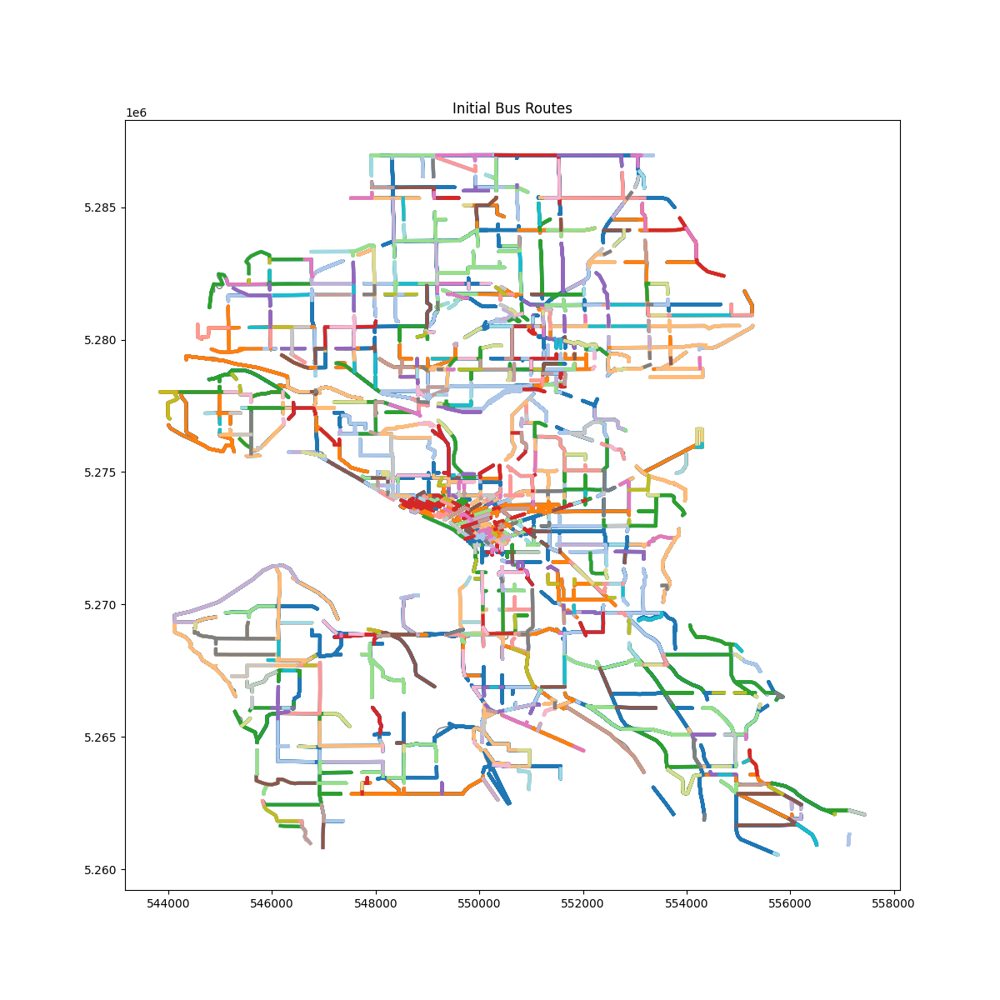

# Bus Route Analysis
This repository provides tools for analyzing and visualizing bus route data from the Seattle Department of Transportation (SDOT). It uses geospatial data to generate interactive and static visualizations of bus routes, including stops and network structure.

## Repository Contents
- **`main.py`** — Core script for loading and analyzing SDOT bus route data.  
- **`SDOT_data.geojson`** — GeoJSON dataset containing bus routes and related geospatial features.  
- **`bus_routes.html`** — Interactive map visualization of bus routes.  
- **`bus_routes_with_stops.html`** — Interactive map visualization including bus routes and their stops.  
- **`initial_routes.png`** — Static preview image of the bus routes.  

## Features

- Loads bus route data from GeoJSON.  
- Processes routes and (optionally) bus stop information.  
- Generates **interactive HTML maps** (via [folium](https://python-visualization.github.io/folium/)) for exploring routes.  
- Creates **static visualizations** for quick reference.  
- Designed for extensibility: you can easily add further analysis steps (e.g., travel time estimation, connectivity metrics, network optimization).  

## Installation

Clone the repository:

```bash
git clone https://github.com/your-username/bus-route-analysis.git
cd bus-route-analysis
````

Install dependencies (ideally in a virtual environment):

```bash
pip install -r requirements.txt
```

### Suggested Dependencies

Based on the code, you’ll need:

* `folium` — for interactive map generation
* `geopandas` — for handling geospatial data
* `matplotlib` — for plotting
* `shapely` — for geometric operations

Install them with:

```bash
pip install folium geopandas matplotlib shapely
```

## Usage

Run the analysis script:

```bash
python main.py
```

This will:

1. Load bus route data from `SDOT_data.geojson`.
2. Process routes and stops.
3. Export interactive HTML visualizations (`bus_routes.html`, `bus_routes_with_stops.html`).
4. Save a static preview (`initial_routes.png`).

You can then open the `.html` files in your browser to explore the maps interactively.

## Example Outputs

* **Static preview**:
  

* **Interactive maps**:

  * [Bus Routes](bus_routes.html)
  * [Bus Routes with Stops](bus_routes_with_stops.html)
